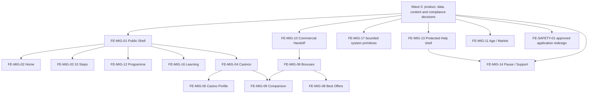

# Frontend Migration Audit and P0 Implementation Plan

Status: **documentation-only audit complete; implementation not authorised by this document**

Date: 2026-08-05

Repository baseline: `ec3e5aa7223aaff2bb4ca0b117e25a37d821edef` on `main`

Figma: [SevenBet](https://www.figma.com/design/UvuJZEzeMAd8cK9TNAueb8)

Governing visual direction: RFC-007 Tilt-Locked Human Product Theatre

## 1. Decision summary

The approved Figma system is substantially ahead of the public Next.js frontend. All 59 approved Figma screen families have been mapped to current routes, components, data readiness, compliance dependencies and an implementation work package. The current application has useful foundations—especially server-owned Programme state, public casino service boundaries and deny-safe affiliate redirect validation—but it is not ready for a visual migration as a single broad rewrite.

Two legacy routes require an explicit P0 safety redesign:

- `/self-check` is **P0_REDESIGN_REQUIRED**. The route is retained in P0 as an acquisition, education and responsible-gambling tool; its current answer-derived commercial recommendations are not approved.
- `/tools/budget-calculator` is **P0_REDESIGN_REQUIRED**. The route is retained in P0 as a personal spending-limit/control tool; its current calculated “Recommended” gambling amount and direct result-to-`/bonuses` action are not approved.

Neither route is `NOT_REQUIRED_FOR_INITIAL_LAUNCH`. Production release of both routes is blocked until **FE-SAFETY-01 — Self-check and Budget Tool Regulatory Redesign** is complete and receives separate product and compliance approval. Monetisation remains on ordinary commercial-discovery routes and must never be driven by stress, impulse-control, harm, vulnerability or other self-check signals.

The recommended first implementation PR is **FE-MIG-01 — Public Shell**. It is the smallest shared dependency that removes competing public shells without changing backend behaviour, Programme policy, rewards, affiliate eligibility or safety-tool product behaviour.

## 2. Evidence and authority

### 2.1 Evidence labels

- **Detected** — directly observed in the checked-out repository, running application or live Figma file.
- **Inferred** — a bounded conclusion supported by detected evidence but not directly encoded as a product decision.
- **Planned** — required future work; not implemented.
- **Not detected** — no adequate repository or Figma evidence was found after the audit scan.

Implementation claims below are based on a scan of the active repository root. Dependencies, `.next`, generated artefacts, caches and `tsconfig.tsbuildinfo` were excluded where appropriate. No secret values were inspected or reproduced.

### 2.2 Governing documents reviewed

The audit follows, in priority order:

1. `docs/Product-Vision-and-Principles.md`.
2. `docs/PROJECT_STATE.md` and `docs/ROADMAP.md`.
3. `docs/01_Product_Master_Plan/Product-Master-Plan.md`.
4. `docs/02_Product_Design/Figma-Screen-Inventory-and-Delivery-Plan.md`.
5. RFC-002, RFC-003, RFC-004, RFC-007, RFC-008, RFC-009 and RFC-010.
6. Programme architecture, backend and Definition of Done standards.
7. Current-system, repository-structure and known-debt technical baselines.
8. Public casino discovery/rendering/cutover and affiliate-routing documentation.

Documentation remains authoritative over code. This audit does not approve a conflicting implementation. Material product, architecture or compliance changes still require the applicable RFC/decision record before code changes.

### 2.3 Figma evidence

**Detected:** the active Figma file has nine pages, approved foundations/components and 59 approved screen families in the 73-family inventory. Live inspection reconfirmed the approved family anchors for Public Shell, Home, 10 Steps, Casinos, Casino Profile, Bonuses, Best Offers, Comparison, Programme, Programme Map, Protected Help, Pause, Commercial Handoff, Age/Market, Identity/Privacy, Learning, Legal/System and Bonus Guide.

**Detected:** active semantic variables include action yellow `#E4E24E`, night surface `#100F0F`, paper `#FAFAF7`, safety teal `#176C65`, muted text `#64635C`, and Archivo Black / Archivo / Instrument Serif typography roles.

**Detected handoff debt:** Motion & Prototype and Ready for Dev pages are empty; variable modes remain generically named; Code Connect could not be inspected with the available Figma seat. The Bonuses family’s visible status text is `APPROVED`, although some underlying layer names still contain “IN PROGRESS”. Visible status and inventory are authoritative; stale layer names should be cleaned during handoff QA without redesigning the family.

**Reference lock:** Figma is the sole visual authority. Refero research was used only to test the coherence of high-contrast editorial surfaces, single-accent action hierarchy, compact responsive navigation, URL-backed filters and deliberate outbound confirmations. No third-party reference authorises deviation from approved Figma.

## 3. Current frontend baseline

### 3.1 Detected route inventory

The non-admin public surface contains 23 page routes plus redirect/route-handler and error surfaces:

| Family | Detected routes | Baseline finding |
| --- | --- | --- |
| Acquisition | `/`, `/10-steps`, `/program` | Home is Tilt-Locked but has a competing custom shell and mobile parity gaps; `/10-steps` is stale; `/program` contains the active Programme experience. |
| Commercial | `/casinos`, `/casino/[slug]`, `/bonuses`, `/best-offers`, `/bonus-guide`, `/catalog` | Public casino service boundaries exist. Most presentation remains legacy. `/catalog` redirects; `/compare` is not detected. |
| Learning/trust | `/learn`, `/learn/[category]`, `/learn/[category]/[slug]`, `/about`, `/methodology`, `/affiliate-disclosure`, `/faq` | Content routes exist with legacy layouts and local/static content sources. |
| Protected support | `/responsible-gambling`, `/responsible-gambling/[slug]`, `/responsible-gaming` | Content exists but renders inside commercial/global chrome; protected shell is not detected. |
| Identity/legal | `/privacy`, `/terms` | Both legal routes are explicit noindex placeholders. No account settings or password recovery route was detected. |
| Safety tools | `/self-check`, `/tools/budget-calculator` | Retained P0 routes with regulatory-risk legacy product behaviour; mandatory redesign required. |
| Outbound/system | `/r/[slug]`, `/go/[slug]`, `not-found`, `error`, `global-error`, `/casinos/error` | Redirect validation and basic recovery exist; approved confirmation, unavailable, loading and protected-context recovery states are incomplete. |

### 3.2 Shared architecture findings

- **Detected:** `app/layout.tsx` applies the legacy `SiteChrome` globally while Home and Programme also render their own shells. This creates competing navigation models and, on some legacy routes, two `<main>` landmarks.
- **Detected:** `SiteChrome` has no approved mobile menu or signed-in variant. Its footer contains legacy product copy and public links but not the complete approved shell contract.
- **Detected:** Programme Missions 01–04 call server APIs and use server-owned reward/progress/dashboard projections. No Prisma import was detected in React client components or Programme route handlers.
- **Detected:** `/casinos` uses the public discovery service, GET/URL query state and deny-safe eligibility flags; the country selector is preference input, not trusted live GEO authority.
- **Detected:** `/bonuses` uses casino views rather than a dedicated governed offer projection. Several filter labels are non-functional presentation, and legacy offer UI can link directly to an affiliate URL.
- **Detected:** `/r/[slug]` validates configured destinations, uses no-store behaviour and fails closed, but current cards do not implement the approved confirmation/unavailable/recovery UI.
- **Not detected:** a live trusted jurisdiction/age-policy dataset, `/compare`, a canonical comparable projection, a governed live offer shortlist, a protected Help layout, public loading boundaries, an accessibility test runner or a maintained visual-regression suite.

### 3.3 Browser QA evidence

Production build output was exercised locally at desktop `1280×900` and mobile `375×812` representative viewports.

- **Detected:** `/`, `/program`, `/casinos`, `/bonuses`, `/best-offers`, `/bonus-guide`, `/responsible-gambling`, `/self-check`, `/tools/budget-calculator`, `/privacy`, `/terms` and missing `/compare` render without document-level horizontal overflow at the tested sizes.
- **Detected:** Home’s hero copy was invisible in the immediate desktop and small-mobile captures because the SSR markup starts at `opacity: 0` and depends on a client `IntersectionObserver` to reveal it. Reduced-motion CSS provides a fallback, but no-JS, delayed-hydration and visual-regression capture behaviour require acceptance testing. The mobile composition also does not match the approved Home contract.
- **Detected:** Programme mobile uses a horizontally clipped commercial navigation row rather than the approved responsive menu contract.
- **Detected:** `/10-steps` and `/best-offers` expose two `<main>` landmarks in the rendered DOM.
- **Detected:** `/bonuses`, `/bonus-guide`, `/responsible-gambling` and `/self-check` do not expose an H1 in their rendered current pages.
- **Detected:** `/compare` resolves to the generic not-found surface.
- **Detected:** `/privacy` and `/terms` identify themselves as placeholders and are noindex.
- **Detected:** the self-check’s all-high-risk path produces “Needs More Information” and still renders “Browse verified casino comparisons” linking to `/casinos`, alongside global commercial navigation.
- **Detected:** the budget calculator defaults to an entertainment budget of 300, four sessions and 20%; presents `$15 per session` and `$60` monthly as `Recommended`; and links “Review offers” to `/bonuses`.
- **Detected accessibility debt:** budget inputs have nearby visible text but no label relationship exposed in the accessibility snapshot; multiple legacy families have missing H1s; focus, reduced-motion, keyboard and screen-reader behaviour need systematic QA.

## 4. Status model and parity totals

The totals and matrix below preserve the repository baseline captured when this audit was approved. They are not silently recomputed after each delivery PR; the dated implementation-status blocks in section 8 are the current evidence for FE-MIG-01 through FE-MIG-03.

Each approved Figma inventory row receives exactly one primary migration status:

- `PARITY` — approved contract is implemented with no material detected gap.
- `CLOSE_PARITY` — the core contract is present; bounded migration work remains.
- `PARTIAL` — meaningful implementation exists, but major approved states/composition are absent.
- `STALE` — a route exists but follows superseded frontend structure or product copy.
- `PLACEHOLDER` — a route/surface exists primarily as non-production content or preview.
- `FRONTEND_MISSING` — no corresponding frontend surface was detected.
- `BLOCKED_BY_DATA` — safe implementation requires a governed data projection or live authority not detected.
- `BLOCKED_BY_PRODUCT` — implementation requires a product/compliance/capability decision first.

The two retained safety routes use `P0_REDESIGN_REQUIRED`; they are not approved Figma inventory rows and therefore are not counted in the 59-family parity total.

| Status | Approved families | Share |
| --- | ---: | ---: |
| `PARITY` | 0 | 0% |
| `CLOSE_PARITY` | 11 | 18.6% |
| `PARTIAL` | 14 | 23.7% |
| `STALE` | 21 | 35.6% |
| `PLACEHOLDER` | 3 | 5.1% |
| `FRONTEND_MISSING` | 3 | 5.1% |
| `BLOCKED_BY_DATA` | 3 | 5.1% |
| `BLOCKED_BY_PRODUCT` | 4 | 6.8% |
| **Total** | **59** | **100%** |

## 5. Approved-family migration matrix

The IDs and product priority come from the approved Figma inventory. “WP” identifies the implementation work package below.

| ID | Approved screen family | Route / integration point | Current frontend evidence | Status | Readiness / blocker | WP |
| --- | --- | --- | --- | --- | --- | --- |
| A01 | Home | `/` | Active Tilt-Locked body; custom shell, standalone Help block and mobile gaps | `PARTIAL` | Frontend-ready after shared shell | FE-MIG-02 |
| A02 | 10 Steps campaign | `/10-steps` | Legacy shell/body and stale `+20 XP` | `STALE` | Programme contract ready; visual migration required | FE-MIG-03 |
| A03 | General Programme explainer | Home modules / `/program` entry | Active narrative and Programme entry, not approved embedded composition | `PARTIAL` | Frontend-ready within Home/10 Steps | FE-MIG-02 |
| A04 | Age / market entry | Global/contextual gate | Shadow resolver only; no trusted live authority or gate | `BLOCKED_BY_PRODUCT` | RFC-001/live policy decision | FE-MIG-11 |
| A05 | Public Header | Global | Legacy + competing custom headers; no complete mobile/account states | `STALE` | Frontend-ready for non-authoritative states | FE-MIG-01 |
| A06 | Public Footer | Global | Legacy footer and copy | `STALE` | Legal copy remains review-gated | FE-MIG-01 |
| B01 | Casinos catalogue | `/casinos` | Functional service/query state; legacy visual composition | `STALE` | Data partially ready | FE-MIG-04 |
| B02 | Casino filters | `/casinos` | URL-backed facets/search/sort exist | `PARTIAL` | Trusted country interpretation unavailable | FE-MIG-04 |
| B03 | Eligibility/restriction | Casino surfaces | Shadow flags; no trusted enforced public state | `BLOCKED_BY_PRODUCT` | Jurisdiction authority required | FE-MIG-11 |
| B04 | Casino cards | `/casinos` | Legacy cards and data projection | `STALE` | Public DTO exists | FE-MIG-04 |
| B05 | Casino profile | `/casino/[slug]` | Published-review route and notFound exist | `PARTIAL` | Governed fields partially ready | FE-MIG-05 |
| B06 | Profile trust/evidence | `/casino/[slug]` | Legacy review sections; incomplete lifecycle presentation | `STALE` | Editorial evidence readiness varies | FE-MIG-05 |
| B07 | Bonuses catalogue | `/bonuses` | Legacy casino-view directory, static-looking filters and table | `STALE` | Dedicated offer projection absent | FE-MIG-06 |
| B08 | Bonus lifecycle states | `/bonuses`, cards | No complete governed current/changed/expired/unavailable projection | `BLOCKED_BY_DATA` | Canonical offer/evidence lifecycle required | FE-MIG-06 |
| B09 | Best Offers | `/best-offers` | Honest static future preview only | `PLACEHOLDER` | Live shortlist/market authority absent | FE-MIG-08 |
| B10 | Comparison desktop | `/compare` | Route not detected | `FRONTEND_MISSING` | Comparable projection also required | FE-MIG-09 |
| B11 | Comparison mobile | `/compare` | Route not detected | `FRONTEND_MISSING` | Comparable projection also required | FE-MIG-09 |
| B13 | Commercial handoff | Cross-cutting; `/r/[slug]` | Safe redirect foundation, no confirmation/unavailable/recovery UI | `BLOCKED_BY_DATA` | Eligibility/reason projection required | FE-MIG-10 |
| C01 | Mission 01 | `/program` | Responsive active mission implemented | `CLOSE_PARITY` | Preserve behaviour; visual QA remains | FE-MIG-12 |
| C02 | Registration gate | `/program` | Mandatory post-M01 claim implemented | `CLOSE_PARITY` | Preserve server claim semantics | FE-MIG-12 |
| C03 | Registration | `/program` | Better Auth email/password sign-up/sign-in implemented | `CLOSE_PARITY` | Recovery states incomplete | FE-MIG-12 |
| C04 | Registration recovery | `/program` | Partial error handling, not complete approved recovery family | `PARTIAL` | Auth policy/content dependency | FE-MIG-12 |
| C05 | Dashboard after M01 | `/program` | Server-owned dashboard state implemented | `CLOSE_PARITY` | Browser/authenticated regression gate | FE-MIG-12 |
| C06 | Dashboard loading/error | `/program` | Generic client loading; approved skeleton/retry incomplete | `PARTIAL` | Server state available | FE-MIG-12 |
| C07 | Mission 02 | `/program` | Implemented with server validation | `CLOSE_PARITY` | Preserve RFC-002/008 behaviour | FE-MIG-12 |
| C08 | Dashboard after M02 | `/program` | `+80 XP`, First Plan and next mission server-owned | `CLOSE_PARITY` | Authenticated browser QA | FE-MIG-12 |
| C09 | Mission 03 | `/program` | Implemented, including Not now path | `CLOSE_PARITY` | Preserve RFC-009 privacy semantics | FE-MIG-12 |
| C10 | Dashboard after M03 | `/program` | Server-owned post-M03 state implemented | `CLOSE_PARITY` | Authenticated browser QA | FE-MIG-12 |
| C11 | Mission 04 | `/program` | Implemented, resumable and server validated | `CLOSE_PARITY` | Date-dependent regression failure must be fixed separately | FE-MIG-12 |
| C12 | Dashboard after M04 | `/program` | Server-owned reward/achievement state implemented | `CLOSE_PARITY` | Authenticated browser QA | FE-MIG-12 |
| C13 | Paused Mission 04 | `/program` | Approved design; no approved product capability detected | `BLOCKED_BY_PRODUCT` | Separate product decision required | FE-MIG-12 |
| C15 | Programme shared shell | `/program` | Strong desktop/mobile implementation | `CLOSE_PARITY` | Mobile nav and a11y polish remain | FE-MIG-12 |
| C16 | Programme Map | `/program` | Compact partial path only | `PARTIAL` | Server mission status available for 01–04 | FE-MIG-12 |
| C17 | My Plan | `/program` | Saved artefacts exist; full approved plan view absent | `PARTIAL` | Preserve private data boundaries | FE-MIG-12 |
| D01 | Protected Help shell | Protected route group | Content exists under commercial shell | `PARTIAL` | Route-group/layout work required | FE-MIG-13 |
| D02 | Help Hub | `/responsible-gambling` | Legacy content and navigation | `STALE` | Governed resource catalogue required | FE-MIG-13 |
| D03 | Protected Help article | `/responsible-gambling/[slug]` | Legacy dynamic article | `STALE` | Content verification required | FE-MIG-13 |
| D04 | Pause / cooling-off | `/responsible-gambling/cooling-off` | Legacy article content | `STALE` | UK content/compliance review | FE-MIG-14 |
| D05 | Limits / self-exclusion | Protected Help routes | Static local content, incomplete governed state handling | `STALE` | Resource verification/availability | FE-MIG-14 |
| D07 | External support handoff | Protected Help | No approved confirmation/unavailable resource flow | `BLOCKED_BY_DATA` | Governed resource registry required | FE-MIG-14 |
| E01 | Learning Hub | `/learn` | Legacy learning centre | `STALE` | Content source exists | FE-MIG-16 |
| E02 | Learning category | `/learn/[category]` | Legacy generated category route | `STALE` | Content source exists | FE-MIG-16 |
| E03 | Learning article | `/learn/[category]/[slug]` | Legacy article route | `STALE` | Evidence lifecycle missing | FE-MIG-16 |
| E04 | Bonus Guide | `/bonus-guide` | Legacy card grid and hard-coded `x35` example | `STALE` | Governed evidence/source states required | FE-MIG-07 |
| E06 | About | `/about` | Content exists in legacy layout | `PARTIAL` | Content/legal review | FE-MIG-17 |
| E07 | Methodology | `/methodology` | Content exists in legacy layout | `PARTIAL` | Published methodology approval | FE-MIG-17 |
| F01 | Sign-in / account entry | `/program?auth=sign-in` | Programme sign-in exists | `PARTIAL` | Identity family and recovery incomplete | FE-MIG-15 |
| F03 | Privacy controls | `/privacy`, future account settings | Privacy placeholder; account controls not detected | `PARTIAL` | Legal/data-subject capability decisions | FE-MIG-15 |
| G01 | Affiliate disclosure | `/affiliate-disclosure` | Legacy static route | `STALE` | Legal copy review | FE-MIG-17 |
| G02 | Responsible-gambling legal/trust | Protected routes | Legacy content under commercial shell | `STALE` | Protected-shell/content review | FE-MIG-13 |
| G04 | General trust/about | `/about` | Legacy composition | `STALE` | Approved copy required | FE-MIG-17 |
| G05 | Privacy policy | `/privacy` | Explicit noindex placeholder | `PLACEHOLDER` | Reviewed privacy notice required | FE-MIG-15 |
| G06 | Terms | `/terms` | Explicit noindex placeholder | `PLACEHOLDER` | Reviewed legal terms required | FE-MIG-17 |
| G09 | 18+ / market explanation | About/global | Legacy fragments only | `STALE` | Jurisdiction wording review | FE-MIG-11 |
| G10 | Account recovery | Identity | Not detected; Better Auth email/password only | `BLOCKED_BY_PRODUCT` | Recovery capability/product decision | FE-MIG-15 |
| H01 | 404 recovery | `not-found` | Implemented minimal legacy recovery | `STALE` | Protected/public context split missing | FE-MIG-17 |
| H02 | General error | `error`, `global-error` | Implemented minimal legacy error | `STALE` | Approved retry/context contract missing | FE-MIG-17 |
| H04 | Loading skeletons | Public/Programme boundaries | Representative public loading files not detected | `FRONTEND_MISSING` | Route-level loading plan required | FE-MIG-17 |
| H05 | Unavailable/restricted | Commercial/protected routes | Scattered partial disabled/notFound states | `PARTIAL` | Governed reason codes required | FE-MIG-17 |

## 6. Mandatory retained-route decision: FE-SAFETY-01

### 6.1 Status and launch rule

**Work package:** FE-SAFETY-01 — Self-check and Budget Tool Regulatory Redesign

**Status:** `P0_REDESIGN_REQUIRED` / `BLOCKED_BY_PRODUCT_BEHAVIOUR — ROUTE RETAINED IN P0`

**Launch rule:** both routes remain in P0, but neither may ship its current mechanic to production. The blocker remains until the redesigned UX, privacy/data flow and regulatory presentation receive separate product and compliance approval.

This audit records the supplied product decision. Because it is material product/compliance work, implementation must also pass the repository’s RFC/decision process before code changes.

### 6.2 `/self-check` current-behaviour audit

**Detected:** `components/SelfAssessment.tsx` asks seven questions covering planning, budget, impulse, time, bonus understanding, decision-making and responsible-gambling-tool familiarity. Client-side scoring assigns a result category and answer-dependent resources. The running high-risk path showed “Needs More Information”, terms-related content and a direct `/casinos` comparison action. Global commercial navigation remains visible on the result screen.

**Risk conclusion:** the current route combines vulnerability/harm-adjacent signals with commercial discovery. It conflicts with the Product Vision’s commercial/safety separation and must not be migrated unchanged.

**Required redesign contract:**

- Preserve self-check as acquisition, education and responsible-gambling support.
- Do not use stress, impulsivity, control, gambling harm or any other vulnerability signal to select, rank or personalise casinos, bonuses or affiliate offers.
- Do not include answers, score or result category in affiliate tracking, analytics payloads used for commercial segmentation, or commercial retargeting.
- Do not show a personalised casino or bonus CTA based on answers.
- For elevated-risk outcomes, prioritise neutral Help, pause, limits and self-exclusion routes.
- Enforce a strict data and service boundary between self-check data and commercial discovery.
- Define privacy notice, lawful basis/consent where applicable, collection minimisation, retention/deletion, access control, analytics policy and DPIA dependency before implementation.
- Treat ordinary global public navigation as non-personalised by default, but separately assess whether its presence, prominence and wording on the result screen create an unsafe regulatory presentation.
- Do not claim diagnosis, treatment or clinical validation.

### 6.3 `/tools/budget-calculator` current-behaviour audit

**Detected:** the route starts with budget 300, four sessions and a 20% ratio, computes a per-session/monthly gambling amount, labels it `Recommended`, gives a 45-minute time cap and links “Review offers” directly to `/bonuses`. It uses `$` while the planned GB launch context requires reviewed currency/market handling.

**Risk conclusion:** the current calculator can imply that SevenBet determines a safe or recommended amount to gamble and immediately bridges that result into offers. It must not be migrated unchanged.

**Required redesign contract:**

- Preserve the route as a personal spending-limit/control tool.
- Remove `Recommended` and any equivalent wording for gambling spend.
- Do not claim or imply that SevenBet calculates a safe or recommended gambling amount.
- Let the user set their own limit from discretionary entertainment budget; do not pre-author a gambling allocation.
- Allow an explicit `£0` limit and do not make zero visually secondary.
- State clearly that setting a limit does not make gambling safe.
- Do not use the amount to select, rank or personalise bonuses, casinos or offers.
- Remove the direct contextual result action to `/bonuses`.
- Separately assess whether neutral general site navigation may remain and how it should be presented in this safety context.
- Resolve currency, locale, storage and analytics behaviour through explicit product/privacy decisions.

### 6.4 Proposed compliant UX direction — not an approved design

This is a requirements gap, not a new Figma design:

- Self-check: neutral introduction → minimal questions → non-diagnostic educational summary → fixed, non-commercial next steps. Higher-risk responses increase the prominence of Help/pause/limits/self-exclusion only; they never change commercial surfaces.
- Budget tool: user-defined optional entertainment context → user-entered limit including zero → plain-language reflection and operator/bank control links → neutral exit/Help. No calculated “safe amount”, commercial result module or offer action.
- Both routes: no hidden commercial event, no answer/result propagation to affiliate or retargeting systems, explicit privacy copy, accessible form semantics and a protected-result presentation review.

### 6.5 Regulatory/privacy dependencies

This plan does not provide legal advice. FE-SAFETY-01 requires documented review against current official sources, including:

- [UK Gambling Commission customer-led financial limits guidance](https://www.gamblingcommission.gov.uk/blog/post/changes-to-customer-led-tools-financial-limits/) and its implementation dates/terminology.
- [CAP gambling responsibility and vulnerable-consumer guidance](https://www.asa.org.uk/resource/revised-responsibility-guidance.html) and [CAP Section 16 guidance](https://www.asa.org.uk/advice-online/betting-and-gaming-general.html).
- [ICO direct-marketing profiling guidance](https://ico.org.uk/for-organisations/direct-marketing-and-privacy-and-electronic-communications/direct-marketing-guidance/collect-information-and-generate-leads/), which specifically identifies targeting people at risk of problem gambling with betting advertising as a potentially significant effect.
- [ICO special-category inference guidance](https://ico.org.uk/for-organisations/uk-gdpr-guidance-and-resources/lawful-basis/special-category-data/what-is-special-category-data/) and DPIA requirements. Whether particular self-check fields/results constitute health or other special-category data is a compliance determination, not an engineering assumption.

### 6.6 Acceptance criteria

1. Both routes remain reachable in P0 and have an approved Figma family before frontend implementation.
2. Current legacy scoring-to-commercial and calculated-recommendation behaviours are removed, not restyled.
3. Self-check answers/results cannot affect commercial ranking, selection, messaging, affiliate parameters or retargeting audiences; automated tests prove the separation.
4. Elevated-risk results provide only neutral safety/control next steps in the contextual result area.
5. Budget limit accepts `0`, uses user-authored input, contains the “does not make gambling safe” explanation and has no contextual bonus/casino action.
6. Privacy/data-flow diagram identifies every collection, client/server boundary, event, storage location, recipient, retention rule and deletion path; “none” is recorded explicitly where applicable.
7. DPIA need, consent/lawful basis, privacy notice, retention and analytics policy receive recorded privacy approval.
8. UKGC/CAP/ICO review dependencies and the regulatory presentation of global navigation are signed off by the named compliance owner.
9. Keyboard, screen-reader, focus, reduced-motion, zoom/reflow and 375/390/1280/1440 browser QA pass.
10. Product and compliance owners explicitly remove the launch blocker; code review alone cannot do so.

## 7. Architecture and migration guardrails

1. Preserve server ownership of Programme XP, completion, prerequisites, achievements, active days and next mission. Frontend migration must not recalculate them.
2. Preserve Programme, protected Help and commercial data separation. Programme/pause/Help/self-check/budget data may not drive affiliate targeting or commercial personalisation.
3. Do not import Prisma into route handlers or React components. Use existing application/service/repository boundaries.
4. Prefer route-group layouts for Public Shell and Protected Help rather than conditional global-shell exceptions.
5. Keep URL-backed discovery filters and server-rendered public data. Do not replace them with client-only shadow state.
6. Use canonical governed public DTOs. Figma operator names, prices, availability and market claims are illustrative until backed by approved data.
7. Keep affiliate destinations behind internal governed redirect identifiers. Never expose raw destination construction to client components.
8. Fail closed on unknown, stale, conflict, unavailable and suspended jurisdiction/offer/resource states.
9. Implement approved responsive states at 1440, 1280, 390×844 and 375×667 representatives; also verify reflow at 320 CSS px and zoom.
10. Reuse Figma tokens/components and the approved single-accent hierarchy. Do not create a second design system during migration.
11. Do not broaden a visual work package into Programme product logic, schema, migration, market-policy or content-authority changes.
12. Every substantial product/compliance/capability change requires its governing RFC/decision before implementation.

## 8. P0 work packages

Common QA for every package: typecheck, production build, affected unit/integration suites, desktop/mobile browser checks, keyboard/focus review, accessibility-tree/landmark/heading checks, reduced-motion check where motion exists, and a before/after evidence record. Branch names are recommendations for future work; this audit does not create them.

### FE-MIG-01 — Public Shell

**Implementation status, 2026-08-05:** `MERGED_IN_CEEE4E7`.

- **Detected implementation:** [PR #15](https://github.com/AlexG-7BE/sevenbet-next/pull/15), merged in `ceee4e7`, introduces a server-owned `app/(public)/layout.tsx`, replaces legacy `SiteChrome`, uses the existing Better Auth server session for account presentation, and isolates mobile route/menu interaction in `PublicNavigation`.
- **Detected route ownership:** the Public Shell applies to `/`, `/10-steps`, commercial discovery/profile routes, `/bonus-guide`, `/learn/**`, public trust/legal routes, `/self-check` and `/tools/budget-calculator`, plus public error/404 presentation. `/program`, `/responsible-gambling/**`, `/responsible-gaming`, `/admin/**` and editorial/internal routes are intentionally excluded. URL paths are unchanged by the route group.
- **Detected shell integration:** Home-owned Header/Footer and the obsolete standalone Help panel are removed; the page body remains unchanged. `/10-steps` and `/best-offers` no longer create a second `<main>`. Programme keeps its existing product shell. Protected Help receives no commercial shell; its approved dedicated shell remains FE-MIG-13.
- **Detected account/availability boundary:** signed-out and signed-in account presentation derive from the server session. XP appears only when an authoritative value is supplied; no XP is invented in this package. Availability Notice `489:70` exists only as generic unknown/unavailable presentation and is not activated as GEO, market, age or eligibility authority.
- **Detected QA:** typecheck, production build, `git diff --check`, 5/5 shell contract tests and 15/15 combined Public Shell/public-casino browser tests pass. Browser checks cover 1440, 1280, 1024, 768, 430, 390 × 844, 375 × 667, 360 and effective 200% reflow, with no shell horizontal overflow. Escape, native modal focus containment, focus return, scroll lock, safe areas, reduced motion, one-main ownership, excluded-shell regressions and 44 × 44 visible targets pass. Evidence is stored in `docs/02_Product_Design/qa/fe-mig-01/`.
- **Detected baseline gaps:** the full Node suite remains 207 passed / 7 failed, with the same date-dependent Mission 04 `reviewAt` fixtures recorded by the audit. `npm run lint` still invokes deprecated interactive `next lint`. No disposable authenticated browser fixture is detected; signed-in behavior is covered by the server-state contract test but still needs an authenticated browser snapshot.
- **Release limitations:** 18+/affiliate/legal wording remains review-gated; public routes become dynamic because the shared layout reads the server session; live availability remains blocked; Protected Help still needs FE-MIG-13. `/self-check` and `/tools/budget-calculator` retain their P0 launch blocker under FE-SAFETY-01, including separate review of global navigation on result states.
- **Next package after merge:** FE-MIG-02 — Home responsive parity is implemented in [PR #16](https://github.com/AlexG-7BE/sevenbet-next/pull/16). This does not reduce the independent priority of FE-SAFETY-01 or FE-MIG-13.

- **Figma source:** Public Shell `492:2268`; Header set `289:43`; Footer set `488:100`; Availability Notice `489:70` only as non-authoritative presentation.
- **Routes/components:** `app/layout.tsx`, `components/SiteChrome.tsx`, shared shell styles; all public non-admin routes.
- **Reuse/refactor/create:** reuse Next layouts and auth session boundary; refactor `SiteChrome`; create route-group ownership if needed. Do not change public route data.
- **Data readiness:** signed-out state is ready; signed-in state may use existing Better Auth session; live market state is not ready.
- **Compliance:** protected Help link must remain neutral; 18+/affiliate/legal wording review-gated; do not claim market availability.
- **Acceptance:** one public shell per route; approved desktop/mobile/menu/account states; one main landmark; skip link/focus order correct; no standalone copied shell in Home/Programme public contexts.
- **QA:** 1440/1280/390/375, menu keyboard/Escape/focus return, signed-out/in snapshots, Help separation regression.
- **Branch/PR:** `feat/frontend-public-shell-migration`; [PR #15](https://github.com/AlexG-7BE/sevenbet-next/pull/15).

### FE-MIG-02 — Home responsive parity

**Implementation status, 2026-08-05:** `MERGED_IN_BEF86BD`.

- **Detected implementation:** [PR #16](https://github.com/AlexG-7BE/sevenbet-next/pull/16), merged in `bef86bd`, preserves the approved ten-section narrative, moves Home back to server rendering, and limits client JavaScript to `HomeProgrammeCarousel`. Critical SSR content no longer depends on `IntersectionObserver` or hydration for visibility.
- **Detected responsive parity:** desktop and mobile compositions follow the unchanged approved Home nodes across 1,440, 1,280, 390 and 375 representatives, with bounded reflow tests down to 320 CSS pixels and no document-level horizontal overflow.
- **Detected authority boundary:** the shared Public Layout remains the only source of anonymous/signed-in account presentation. Home fetches no Dashboard/Programme state, calculates no XP/progress/next Mission, and does not use Programme or safety data for commercial personalization.
- **Detected QA:** 5/5 Home contract tests and 39/39 combined Home/Public Shell/public-casino browser tests pass against the production build. Coverage includes no-JS, delayed hydration, missing `IntersectionObserver`, reduced motion, navigation/history, keyboard and announcements, 44px targets, mobile menu, key-route/404 regressions and widths 1440–320. Evidence is stored in `docs/02_Product_Design/qa/fe-mig-02/`.
- **Detected baseline gaps:** the full Node suite remains 212 passed / 7 failed because fixed Mission 04 `reviewAt` fixtures are now outside the next-30-days validation window. `npm run lint` still invokes deprecated interactive `next lint`. An authenticated disposable browser fixture and per-asset archival provenance remain not detected.
- **Next package after merge:** FE-MIG-03 — 10 Steps campaign landing is implemented on `codex/fe-mig-03-ten-steps` and awaits review/merge.

- **Figma source:** desktop `661:7551`, mobile `657:2545`, preserved 1440 `289:946`.
- **Routes/components:** `/`, `components/home/TiltHome.tsx`, module CSS.
- **Reuse/refactor/create:** reuse approved Public Shell; refactor Home-owned header/footer and standalone Help block; preserve narrative sections and imagery pending asset/licence review.
- **Data readiness:** mostly static; returning-user first fold depends on auth/Programme projection.
- **Compliance:** no clinical claim; Help remains available through approved shell; commercial modules cannot use Programme data.
- **Acceptance:** hero copy legible; 10-section contract and responsive first folds match; no competing shell; removed standalone Help panel; returning state uses server truth.
- **QA:** visual comparison, image loading/alt, carousel keyboard/announcement, reduced motion, mobile menu regression.
- **Branch/PR:** `codex/fe-mig-02-home-parity`; [PR #16](https://github.com/AlexG-7BE/sevenbet-next/pull/16).

### FE-MIG-03 — 10 Steps campaign landing

**Implementation status, 2026-08-05:** `MERGED_IN_D85146E`.

- **Detected implementation:** [PR #17](https://github.com/AlexG-7BE/sevenbet-next/pull/17) replaces the stale route with the approved seven-section campaign body while retaining FE-MIG-01 Public Shell ownership. `+20 XP`, `UK PREVIEW`, `UK-ready discovery` and local commercial-discovery links are removed; canonical Programme entry remains `/program`.
- **Detected authority boundary:** anonymous visitors do not trigger a Dashboard read. Signed-in returning XP, completed count and current Mission are rendered only from `programmeDashboardService.getDashboard(userId)`. Missing/unavailable Programme projection fails closed to a signed-in fallback without invented values. The resolver uses the existing Mission registry completion contract (`completion !== null`) rather than duplicating availability policy.
- **Detected reward/capability truth:** signed-out `+60 XP` is labelled `SAVE TO EARN` and `Awarded when Mission 01 is saved to your account.` Awarded XP appears only from the returning Dashboard projection. Missions 01–04 are the current path; Missions 05–10 are explicitly planned/not yet available. A current Mission 01–04 remains resumable; a Dashboard current Mission 05 maps to `available-programme-complete`, preserves server totals, offers `Open My Programme` and does not present Mission 05 as available or next.
- **Detected separation:** the page contains no casino, bonus, best-offer, affiliate, market or eligibility body action. Programme, pause and Help data are explicitly excluded from affiliate targeting and commercial personalisation. Help remains in the shared Header/Footer only.
- **Detected QA:** 8/8 route contract tests and 13/13 route browser tests pass. Combined Home/Public Shell/public-casino/10 Steps browser regressions pass 52/52 against `next start`, including no-JS, reduced motion, 44px targets, menu focus/Escape and widths 1,440 through 320 with no horizontal overflow. Typecheck and production build pass. Evidence is stored in `docs/02_Product_Design/qa/fe-mig-03/`.
- **Detected baseline gaps:** the full Node suite is 220 passed / 7 failed with the unchanged stale Mission 04 `reviewAt` fixtures. `npm run lint` remains blocked by deprecated interactive `next lint`. No approved disposable authenticated browser fixture is detected, so returning server state is contract-tested but its authenticated route screenshot remains a review gate.
- **Scope confirmation:** no backend/API/Prisma/schema/migration, Programme reward/order/prerequisite, protected Help, commercial eligibility, other route body or Figma change is included.
- **Next package after merge:** FE-MIG-04 — Casinos catalogue and filters, implemented on its separate branch.

- **Figma source:** desktop family `502:2238` with full 1,440 `502:2240` and 1,280 `502:2241`; mobile family `502:2412` with full signed-out 390 `502:2414`, returning 390 first fold `502:2415` and signed-out 375 first fold `502:2416`; evidence card set `506:640`.
- **Routes/components:** `/10-steps`, shared page-template components.
- **Reuse/refactor/create:** reuse Public Shell and Programme entry URL; replace stale body rather than carrying legacy layout.
- **Data readiness:** Programme contract ready; returning state uses server/session truth.
- **Compliance:** signed-out `+60 XP` may appear only as a clearly pending post-account-creation preview; awarded XP requires the completed Mission 01 claim in server Dashboard truth. No commercial reward linkage; no standalone Help block.
- **Acceptance:** approved signed-out/returning/small-mobile states; no `+20 XP`; one main; CTA enters Mission 01 without rewriting Programme state.
- **QA:** copy assertions, authenticated/anonymous browser states, responsive and accessibility checks.
- **Branch/PR:** `codex/fe-mig-03-ten-steps`; [PR #17](https://github.com/AlexG-7BE/sevenbet-next/pull/17), merged in `d85146e` before FE-MIG-04 began.

### FE-MIG-04 — Casinos catalogue and filters

**Implementation status, 2026-08-05:** `IMPLEMENTED_IN_PR_18 — REVIEW/MERGE REQUIRED`.

- **Detected implementation:** the legacy catalogue body is replaced by the approved night/paper/acid hierarchy while FE-MIG-01 remains the only Header/Footer and `<main>` owner. Dynamic SSR, `PublicCasinoDiscoveryService`, current published snapshots, deterministic query parsing and governed `/r/[slug]` remain unchanged authorities.
- **Detected URL and client boundary:** search, six facets, four availability switches, sort and page size are canonical GET controls. Each form preserves the other normalized controls and drops stale `page`; active chips use public labels and accessible remove names. Only the mobile modal lifecycle is client-side. Results, cards, eligibility and reason mapping remain server-owned; a `noscript` GET-form fallback is present.
- **Detected commercial/safety boundary:** country is labelled as a market preference, not location or legal eligibility. A visit action renders only when `available`, a safe `redirectSlug` and the local redirect route are present. Otherwise the review remains accessible and the mapped explanation exposes no provider or private failure detail. Affiliate disclosure precedes cards; no fake rating, review count, freshness, bonus or illustrative Figma operator is synthesized.
- **Detected QA:** 12/12 FE-MIG-04 contract/service tests and 5/5 Playwright tests pass with TypeScript and the production build. Browser coverage includes desktop SSR, complete URL-state preservation, modal semantics, Escape/focus return/scroll lock, no-JS fallback, horizontal overflow and `/catalog` redirect. Before/after evidence is in `docs/02_Product_Design/qa/fe-mig-04/`.
- **Detected fixture gap:** the connected local data set contains no published Casino, so populated/provider-backed and no-eligible-action visual captures cannot be produced without changing canonical data. Loading/error source contracts pass, but deterministic boundary screenshots remain a release-environment gate.
- **Scope confirmation:** no backend/API/Prisma/schema/migration, redirect-engine, jurisdiction authority, Figma node, other route body or FE-MIG-05 change is included.
- **Next package after review/merge:** FE-MIG-05 — Casino Profile.
- **Branch/PR:** `codex/fe-mig-04-casinos`; [PR #18](https://github.com/AlexG-7BE/sevenbet-next/pull/18).

- **Figma source:** desktop `520:2496`, mobile `521:312`.
- **Routes/components:** `/casinos`, `components/casino-discovery/CasinoDiscovery.tsx`, public discovery service/types.
- **Reuse/refactor/create:** preserve server service and URL query parser; refactor presentation/cards; create approved empty/loading/error/unknown states.
- **Data readiness:** catalogue/filter data partially ready; country is a preference, not trusted eligibility.
- **Compliance:** label uncertainty; no unsupported “available in your country” claim; affiliate action only when governed visit action exists.
- **Acceptance:** URL state remains shareable; all approved responsive filters/cards/states; no client shadow eligibility; disabled reason is understandable.
- **QA:** query/filter/sort/pagination regression, no-JS GET behaviour, keyboard filters, mobile drawer/focus, empty/error states.
- **Branch/PR order:** `codex/fe-mig-04-casinos`; PR 4 after shell.

### FE-MIG-05 — Casino Profile

- **Figma source:** desktop `529:2850`, mobile `530:809`.
- **Routes/components:** `/casino/[slug]`, casino review renderer/sections.
- **Reuse/refactor/create:** reuse public service and published editorial projection; refactor page composition; create lifecycle/unavailable and outbound-entry states.
- **Data readiness:** published profiles exist; evidence completeness and trusted eligibility vary.
- **Compliance:** distinguish editorial fact, operator claim, freshness and unavailability; internal governed outbound only.
- **Acceptance:** approved hierarchy/responsive state; draft/archived remain non-public; unknown data is not invented; contextual offer action obeys eligibility projection.
- **QA:** representative published/legacy/missing/disabled cases, metadata/robots, keyboard, mobile, outbound handoff integration.
- **Branch/PR order:** `codex/fe-mig-05-casino-profile`; after FE-MIG-04 and before Handoff adoption.

### FE-MIG-06 — Bonuses catalogue and lifecycle

- **Figma source:** desktop `541:3002`, mobile `541:3950`.
- **Routes/components:** `/bonuses`, offer cards/table/filter presentation.
- **Reuse/refactor/create:** reuse public casino service only where fields are canonical; create a dedicated governed offer projection/service before claiming lifecycle truth.
- **Data readiness:** **blocked for full P0 behaviour** by canonical offer lifecycle and market eligibility; safe non-action states may be built first.
- **Compliance:** terms and material conditions before action; no direct raw affiliate URL; changed/expired/unavailable states fail closed.
- **Acceptance:** functional filters only; approved responsive cards/list/states; canonical data source documented; internal handoff used; illustrative values removed.
- **QA:** current/changed/expired/unavailable fixtures, filter URL tests, mobile, a11y, outbound contract.
- **Branch/PR order:** `codex/fe-mig-06-bonuses`; after data projection decision and FE-MIG-10 contract.

### FE-MIG-07 — Bonus Guide

- **Figma source:** desktop `694:5455`, mobile `694:8724`.
- **Routes/components:** `/bonus-guide`, learning article primitives.
- **Reuse/refactor/create:** reuse Learning article/evidence primitives and Public Shell; remove ungoverned hard-coded examples.
- **Data readiness:** content exists but evidence lifecycle is not governed.
- **Compliance:** no universal wagering claim; source date/review/unavailable state; neutral education before offers.
- **Acceptance:** approved continuous-reading contract; reviewed examples only; evidence status; no contextual pressure CTA.
- **QA:** headings/landmarks, long-copy reflow, links, source-unavailable state, mobile/a11y.
- **Branch/PR order:** `codex/fe-mig-07-bonus-guide`; after FE-MIG-16 primitives or in a narrowly ordered shared-primitives PR.

### FE-MIG-08 — Best Offers

- **Figma source:** desktop `556:3336`, mobile `557:1470`.
- **Routes/components:** `/best-offers`.
- **Reuse/refactor/create:** preserve honest placeholder until canonical eligible shortlist exists; then implement approved ranked editorial surface.
- **Data readiness:** **blocked by data**—live eligible offers, methodology and market authority not detected.
- **Compliance:** ranking rationale and affiliate disclosure; no “best” claim without published method/current evidence.
- **Acceptance:** no illustrative operator/offer published as live; complete loading/empty/unavailable; governed handoff only.
- **QA:** ranking fixtures, unavailable/unknown, mobile/a11y, evidence freshness.
- **Branch/PR order:** `codex/fe-mig-08-best-offers`; after FE-MIG-06/data authority.

### FE-MIG-09 — Comparison

- **Figma source:** desktop `567:3592`, mobile `569:1589`.
- **Routes/components:** create `/compare`; comparison selection/result components and service projection.
- **Reuse/refactor/create:** reuse canonical casino/offer DTOs and Public Shell; do not repurpose the legacy 11-column bonus table as the comparison engine.
- **Data readiness:** **blocked by data**—comparable projection, reason mapping, eligibility and freshness required.
- **Compliance:** “comparable means comparable”; unknowns explicit; no unsupported winner/safety claim.
- **Acceptance:** two-to-three item flow, URL/share state if approved, mobile comparison contract, no selection from ineligible/unknown data, governed outbound only.
- **QA:** selection limits, mismatch/unknown fixtures, keyboard table/cards, 320/375 reflow, no-JS/read-only recovery.
- **Branch/PR order:** `codex/fe-mig-09-comparison`; after FE-MIG-04/05/06 data contracts.

### FE-MIG-10 — Commercial Handoff

- **Figma source:** desktop `679:5238`, mobile `679:8391`.
- **Routes/components:** cross-cutting commercial CTA; `/r/[slug]`; optional confirmation surface.
- **Reuse/refactor/create:** preserve redirect validator/response; create confirmation, unavailable and recovery UI; centralise presentation without centralising protected data.
- **Data readiness:** redirect foundation ready; eligibility/reason authority incomplete.
- **Compliance:** clear external destination/affiliate disclosure; fail closed; no vulnerability/Programme/Help/safety data enters tracking.
- **Acceptance:** no raw external affiliate URLs in public components; confirmation and cancellation accessible; unknown/disabled/stale reason prevents outbound; tracking schema excludes protected signals.
- **QA:** redirect-engine regression, malicious/disabled/stale cases, keyboard dialog/focus/Escape, no-store and referrer/tracking review.
- **Branch/PR order:** `codex/fe-mig-10-commercial-handoff`; before commercial families activate actions.

### FE-MIG-11 — Age / Market Boundary

- **Figma source:** generic `489:70`; desktop `686:5333`; mobile `686:8301`.
- **Routes/components:** global/contextual availability state; discovery/profile/offer integration.
- **Reuse/refactor/create:** reuse shadow resolver concepts only after authority decision; create fail-closed UI state contract.
- **Data readiness:** **blocked by product/data**—no approved live policy store or age-verification capability.
- **Compliance:** RFC-001 is proposed; do not treat IP/country preference as legal eligibility; reviewed GB/other-market wording.
- **Acceptance:** unknown/conflict/stale/restricted/unsupported/unavailable/suspended states; no false detected-location claim; action suppression is server-enforced.
- **QA:** reason-code fixtures, cache/stale behaviour, spoofed preference, mobile/reflow, fail-closed integration.
- **Branch/PR order:** `codex/fe-mig-11-market-boundary`; only after approved jurisdiction decision/data.

### FE-MIG-12 — Programme visual gaps and My Plan

- **Figma source:** Programme mobile `580:1713`, desktop source families through Mission 04, Map `666:4862`, mobile Map `668:2671`.
- **Routes/components:** `/program`, `ActiveControlProgramme.tsx` and CSS; existing Programme APIs untouched unless a separately proven defect is approved.
- **Reuse/refactor/create:** reuse all server-owned state/reward flows; refactor mobile nav and visual states; create full map/My Plan/loading/retry UI from existing projections where truthful.
- **Data readiness:** Missions 01–04 ready; Missions 05–10 task content not approved; paused Mission 04 blocked by product.
- **Compliance:** RFC-002/008/009/010; private artefacts; no commercial targeting; no client reward calculation.
- **Acceptance:** no reward/order/prerequisite change; approved responsive states; full map distinguishes unimplemented missions; loading/retry never invents XP/state; authenticated regression passes.
- **QA:** anonymous claim, sign-in, Missions 01–04, edit/delete, replay/concurrency suites, 375/390/1280/1440, keyboard/forms/focus.
- **Branch/PR order:** `codex/fe-mig-12-programme-parity`; after shell; split by visual family if review size grows.

### FE-MIG-13 — Protected Help shell and Hub

- **Figma source:** desktop `599:3886`, mobile `600:1713`.
- **Routes/components:** protected route group for `/responsible-gambling` and safety/support articles.
- **Reuse/refactor/create:** reuse content routes but create dedicated protected layout/header/footer; remove commercial body/navigation/actions from protected context.
- **Data readiness:** local content exists; governed live resource catalogue not complete.
- **Compliance:** protected Help behaviour, neutral exits, no casino/bonus/affiliate CTA or tracking; reviewed urgent/local wording.
- **Acceptance:** protected shell is structurally separate; direct/deep links remain protected; global public shell cannot wrap the route; resource uncertainty is explicit.
- **QA:** route-group regression, commercial-link/tracker absence assertions, keyboard/mobile/a11y, unavailable resource states.
- **Branch/PR order:** `codex/fe-mig-13-protected-help`; high-priority PR after Public Shell.

### FE-MIG-14 — Pause, limits, self-exclusion and support handoff

- **Figma source:** Pause desktop `674:5143`, mobile `674:8171`; Protected Help external-handoff states.
- **Routes/components:** `/responsible-gambling/cooling-off` and governed support-resource detail/actions.
- **Reuse/refactor/create:** reuse Protected Help shell; create verified resource registry/projection and neutral confirmation/unavailable states.
- **Data readiness:** **blocked for production** by content/resource governance and availability.
- **Compliance:** current UKGC/operator/Gamstop/GamCare wording, no invented local number, no commercial bridge.
- **Acceptance:** reviewed pause/limit/self-exclusion routes; source owner/date; safe fallback when resource is unavailable; one neutral primary action.
- **QA:** link verification in CI/release checklist, offline/unavailable fixtures, keyboard/mobile/a11y, no commercial calls.
- **Branch/PR order:** `codex/fe-mig-14-pause-support`; after FE-MIG-13 and content approval.

### FE-MIG-15 — Identity and Privacy

- **Figma source:** desktop `613:4023`, mobile `624:1930`.
- **Routes/components:** Programme account entry, `/privacy`, future account/privacy settings only when capability is approved.
- **Reuse/refactor/create:** reuse Better Auth sign-in/up; refactor approved visual states; keep unsupported recovery/settings visibly unavailable rather than fake-functional.
- **Data readiness:** sign-in ready; recovery/export/erasure/settings capability incomplete.
- **Compliance:** privacy notice, retention, account-wide export/erasure, session security and protected Programme data.
- **Acceptance:** truthful capability states; no placeholder presented as complete policy; errors do not leak account existence; privacy controls map to real server actions.
- **QA:** auth error/recovery enumeration, keyboard/forms/autocomplete, session states, legal-copy sign-off.
- **Branch/PR order:** `codex/fe-mig-15-identity-privacy`; sign-in visual slice may precede capability work; policy/settings wait.

### FE-MIG-16 — Learning and Articles

- **Figma source:** desktop `632:4237`, mobile `634:2074`.
- **Routes/components:** `/learn`, category and article routes; learning data/components.
- **Reuse/refactor/create:** reuse content model/search and Public Shell; refactor hub/category/article primitives; create source/unavailable states.
- **Data readiness:** static content available; evidence lifecycle/governance incomplete.
- **Compliance:** separate protected Help articles from neutral/commercial learning; source/freshness labels; no disguised promotion.
- **Acceptance:** approved responsive hub/category/article; accessible search; protected content routes to protected shell; content evidence visible.
- **QA:** generated paths, search keyboard/empty state, heading hierarchy, long copy/mobile, metadata/links.
- **Branch/PR order:** `codex/fe-mig-16-learning`; after shell; before Bonus Guide if sharing primitives.

### FE-MIG-17 — Legal, Trust and System States

- **Figma source:** desktop `646:4467`, mobile `649:2257`; recovery set `643:6828`.
- **Routes/components:** `/about`, `/methodology`, `/affiliate-disclosure`, `/terms`, 404/error/loading/unavailable surfaces.
- **Reuse/refactor/create:** reuse content routes and Next boundaries; refactor layouts; create route-level loading and protected/public recovery variants.
- **Data readiness:** about/methodology/disclosure copy exists; terms not approved; reason codes incomplete.
- **Compliance:** legal approval, affiliate disclosure prominence, protected recovery has no commercial fallback, skeletons never invent data.
- **Acceptance:** reviewed legal pages only; approved responsive compositions; one H1/main; context-safe 404/error/retry/loading; no fake availability/reward/offer values.
- **QA:** forced 404/500/loading/unavailable, metadata/noindex, retry, keyboard/mobile/a11y.
- **Branch/PR order:** `codex/fe-mig-17-legal-system`; system primitives can be an early small PR; legal content waits for approval.

### FE-SAFETY-01 — Self-check and Budget Tool Regulatory Redesign

- **Figma source:** **gap—no approved dedicated redesign family detected**. New design is required but explicitly out of scope for this audit.
- **Routes/components:** `/self-check`, `components/SelfAssessment.tsx`, `/tools/budget-calculator`, any analytics/affiliate event boundaries.
- **Reuse/refactor/create:** retain routes and neutral education/control intent; replace current product mechanics after RFC/product/compliance approval; create explicit data-flow boundary.
- **Data readiness:** current client state exists but is not approved for production behaviour. Storage/analytics/retention state must be explicitly decided.
- **Compliance:** UKGC/CAP/ICO review, privacy/consent/retention/DPIA, commercial separation and result-screen navigation review.
- **Acceptance/QA:** all requirements in section 6, including browser and accessibility QA, automated non-personalisation assertions and explicit launch-blocker removal.
- **Branch/PR order:** `codex/fe-safety-01-regulatory-redesign`; product/RFC/privacy/Figma approval precedes application-code PR. It is a mandatory P0 blocker, not a deferred enhancement.

## 9. Dependency order and delivery waves

Wave number is not priority. FE-SAFETY-01 is P0 and a launch blocker; its code work appears later only because the product, privacy, compliance and Figma prerequisites must be completed first.

## 10. Risk register

| Risk | Evidence / impact | Mitigation / owner gate |
| --- | --- | --- |
| Vulnerability-based commercial personalisation | Self-check high-risk result links to casino comparison | FE-SAFETY-01; automated separation tests; compliance sign-off |
| Recommended gambling amount | Budget tool calculates and labels spend as Recommended | FE-SAFETY-01 redesign; user-authored £0-capable limit |
| Safety-to-bonus bridge | Budget result links directly to `/bonuses` | Remove contextual action; navigation presentation review |
| Protected Help contamination | Responsible-gambling routes use commercial shell | FE-MIG-13 dedicated route group and tracker/link assertions |
| False jurisdiction confidence | Preference/shadow resolver can be mistaken for live eligibility | FE-MIG-11 fail-closed authority; RFC/data approval |
| Illustrative Figma content published as truth | Operator/offer/market values are design examples | Canonical projections; fixtures; content/data approval |
| Raw/direct affiliate action | Legacy bonus UI can use direct affiliate URL | FE-MIG-10 internal handoff contract and code assertions |
| “Best”/ranking claim without method | Best Offers is currently only a preview | Keep placeholder until method/current eligible data exists |
| Client/server Programme drift | Broad redesign could rewrite rewards/progress | FE-MIG-12 guardrails and existing domain regressions |
| Competing shells / landmarks | Global SiteChrome plus local shells; duplicate main | FE-MIG-01 route-group ownership and landmark tests |
| Mobile navigation clipping | Programme commercial nav clips horizontally | Public/Programme responsive contract and 320/375 QA |
| Reveal-dependent acquisition message | Home SSR starts hero copy at zero opacity until a client observer runs | FE-MIG-02 no-JS/delayed-hydration/reduced-motion and visual acceptance |
| Accessibility regression | Missing H1s, unlabeled budget inputs, no automated a11y runner | Add package-level semantic checks and selected axe-equivalent tooling by approved engineering decision |
| Empty loading states | Public `loading.tsx` surfaces not detected | FE-MIG-17 neutral skeleton/retry states |
| Legal placeholder release | Privacy and Terms explicitly unfinished/noindex | Legal approval gate; release assertion |
| Stale content evidence | Bonus guide hard-coded example, local help resources | Governed evidence lifecycle and review dates |
| Date-dependent Programme tests | Seven Mission 04 flow tests currently fail on stale `reviewAt` fixtures | Separate non-product test-fixture fix before Programme migration completion |
| Lint baseline unavailable | `npm run lint` invokes deprecated interactive `next lint` | Separate engineering debt PR for ESLint CLI; do not hide failure |
| No maintained cross-route visual regression | `visual:qa` is a small script, not an approved baseline suite | Establish representative approved snapshots and review ownership |
| Oversized migration PR | Shared CSS/shell changes can obscure product changes | One family/work package per PR; diff and route-scope limits |

## 11. Validation baseline recorded by this audit

| Check | Result on 2026-08-05 | Classification |
| --- | --- | --- |
| `npm run typecheck` | Pass | **Detected** |
| `npm run build` | Pass; 61 static-generation units and current route manifest produced | **Detected** |
| Public casino discovery/rendering + responsible-gambling safety tests | Pass | **Detected** |
| Programme domain tests | Pass | **Detected** |
| Programme flow tests | 7 failures, all reached stale Mission 04 `reviewAt must be in the next 30 days` fixtures | **Detected baseline debt**; not changed in docs-only audit |
| `npm run lint` | Fails/blocks on deprecated interactive `next lint` configuration prompt | **Detected baseline debt** |
| Desktop/mobile browser smoke | Completed for representative public, Programme, protected, legal and safety routes | **Detected** |

The failing baseline items are not caused by documentation changes and must not be represented as passing in future migration PRs.

## 12. Definition of Done for a migration PR

A work package is complete only when all applicable items pass:

1. Approved Figma nodes and responsive/state representatives are named in the PR.
2. No unapproved product, reward, eligibility, ranking, safety, privacy or legal behaviour is introduced.
3. Server/client/data boundaries remain compliant with governing RFCs and standards.
4. Route has one correct main landmark, a clear H1, skip-link behaviour, keyboard navigation and visible focus.
5. Desktop 1440/1280 and mobile 390/375 representatives pass; 320 CSS px/zoom reflow is usable.
6. Loading, empty, error, unavailable, restricted and retry states are implemented where the Figma family requires them.
7. Unknown data is not converted into a positive claim. Commercial actions fail closed.
8. Protected contexts contain no casino, bonus, affiliate CTA or commercial tracker.
9. Programme/safety/private data cannot affect commercial presentation or tracking.
10. Typecheck, production build, affected tests and browser/a11y QA pass; baseline failures are either fixed in a scoped PR or explicitly recorded.
11. No application secrets, raw affiliate destinations or private data appear in rendered/client payloads.
12. Documentation and inventory are updated if factual status changes.
13. Product/compliance/legal/data owner approvals are attached where the package lists them.
14. Screenshots are QA evidence only and do not replace semantic/accessibility checks.
15. PR stays within one work package or an explicitly approved shared-primitives slice.

Programme work additionally remains subject to `Programme-Definition-of-Done.md`, including regression tests and documentation. FE-SAFETY-01 additionally requires explicit product, privacy and compliance removal of its launch blocker.

## 13. Recommended first implementation PR

**Title:** `feat(frontend): migrate approved public shell`

**Branch:** `codex/fe-mig-01-public-shell`

**Scope:** Header, Footer, mobile menu, signed-out/in presentation, skip/main ownership and shared route-group integration only.

**Explicit exclusions:** no Home body redesign, no Programme logic, no market detection, no commercial ranking/data work, no Help content redesign, no self-check/budget changes, no backend/API/Prisma change.

Why first: every public acquisition, commercial, learning, trust and legal family depends on one stable responsive shell. It also removes the current competing-shell/duplicate-landmark problem and creates the layout boundary needed for the separate Protected Help shell. It should not activate the Availability Notice as live truth; only non-authoritative unknown/unavailable presentation may be included until FE-MIG-11 is approved.

Suggested PR sequence:

1. Add shared tokens/primitives strictly required by the approved Header/Footer.
2. Introduce route-group shell ownership and remove global double-wrapping.
3. Migrate Header desktop/mobile/account variants and keyboard behaviour.
4. Migrate Footer with protected Help link and reviewed placeholder handling.
5. Add route smoke/landmark/menu tests and desktop/mobile browser evidence.

## 14. Launch gate statement

- `/self-check` and `/tools/budget-calculator` **remain P0 routes**.
- Their **current mechanics are not approved** and must not be copied into the migrated frontend.
- Their redesign is mandatory P0 work under **FE-SAFETY-01**.
- Production release of both routes is blocked until FE-SAFETY-01, privacy/data-flow review and UKGC/CAP/ICO-informed compliance review are complete and separately approved.
- Commercial monetisation may continue only on normal governed discovery/profile/offer routes. It must not use vulnerability, self-check, Programme, pause, Help or budget-tool signals for selection, ranking, personalisation, affiliate tracking or retargeting.
- This audit changes documentation only. It does not authorise application code, backend/API/Prisma changes or a new Figma design.
