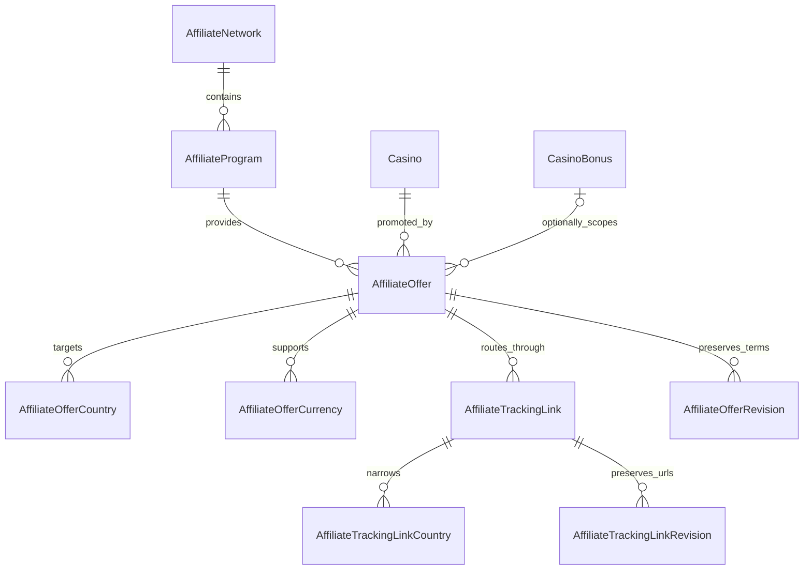

# Affiliate Platform Foundation

## Purpose

Phase 3.5 introduces an additive PostgreSQL model for multi-network, multi-GEO affiliate offers. It does not replace `AffiliateLink`, `CasinoAffiliateLink`, or the current `/go/[slug]` route.

## ER diagram

## Entities and responsibilities

- `AffiliateNetwork`: network identity, type, public website, import/export capability flags, active state, and non-secret operational notes.
- `AffiliateProgram`: an operator account within a network. External program IDs are unique per network; supported country/currency arrays describe the commercial account envelope.
- `AffiliateOffer`: the casino and optional structured bonus commercial agreement. It owns payout terms, independent lifecycle, dates, GEO, player currencies, and priority.
- `AffiliateOfferCountry` and `AffiliateOfferCurrency`: normalized targeting rows used for conflict prevention and future candidate queries.
- `AffiliateTrackingLink`: a server-side destination/tracking pair with narrower targeting, source reference, campaign, landing-page label, promo code, creative reference, verification dates, and deterministic priority.
- `AffiliateTrackingLinkCountry`: normalized link-level GEO rules.
- `AffiliateOfferRevision`: immutable snapshots before offer/terms updates.
- `AffiliateTrackingLinkRevision`: immutable previous destination and tracking URLs before link updates or archival.

## Deliberate consolidation

Landing pages, coupons, campaigns, creatives, and redirect rules are concepts in the aggregate rather than separate tables in this phase:

- landing page is represented by `destinationUrl` plus `landingPage`;
- coupon is represented by `promoCode`;
- campaign is represented by `campaign`;
- creative is represented by a non-secret `creativeReference`;
- redirect rules are represented by link GEO/currency/device/language fields plus country rows.

Separate entities are deferred until an importer, asset lifecycle, attribution model, or many-to-many reuse requires them. This keeps migration 0007 production-safe without blocking later normalization.

## Lifecycle

Affiliate programs and offers use `DRAFT → ACTIVE → PAUSED/EXPIRED → ARCHIVED`. Paused records may return to active; expired and archived records return to draft for deliberate review. Networks use `active` plus `archivedAt`. An inactive or archived network/program prevents active candidate use even if a child offer is marked active.

Casino editorial workflow and affiliate workflow are independent. Publishing a casino never publishes an offer.

## GEO and currency

Countries use ISO 3166-1 alpha-2 codes and currencies use ISO 4217 codes. `GLOBAL` has no country rows; `ALLOW` and `BLOCK` require rows matching the parent mode. Unique constraints prohibit duplicate country and currency rows. Payout currency is separate from currencies available to players.

## Payout validation

Supported payout models are `CPA`, `CPL`, `REV_SHARE`, `HYBRID`, `FLAT`, and `UNKNOWN`. Negative values are rejected. CPA/CPL/FLAT require a positive amount and payout currency. Revenue share is constrained to 0–100. Hybrid requires positive fixed payout, revenue share, currency, and explanatory terms.

## Repository and service boundaries

Repositories own Prisma queries, transactions, revisions, and audit writes:

- `AffiliateNetworkRepository`: list/find/create/update/slug uniqueness.
- `AffiliateProgramRepository`: aggregate list/find/create/update and network-scoped external ID checks.
- `AffiliateOfferRepository`: aggregate load, list without tracking URLs, create/update, URL history, active candidate queries, and program-scoped external link checks.

Services own normalization, ISO and URL validation, uniqueness, status transitions, ancestor state checks, casino/bonus ownership, payout consistency, GEO conflicts, tracking specificity, and candidate eligibility inputs. Client components never import Prisma.

## Admin API

Protected Better Auth staff endpoints exist under `/api/admin/affiliate/{networks,programs,offers}` with collection `GET/POST` and item `GET/PATCH`. Every handler requires `affiliate.manage`. Collection offer responses omit tracking URLs; full detail is available only through a protected offer endpoint because no client editor exists yet.

## Security

Only HTTPS website, destination, and tracking URLs are accepted. `javascript:`, `data:`, and other protocols are rejected. Notes are checked for obvious API key/secret patterns. Credentials must live in environment variables or a future encrypted secret store, never these records. Tracking query strings must not be logged.

## Legacy coexistence and migration strategy

1. Apply additive migration `0007_affiliate_platform_foundation` after review.
2. Build the Phase 3.6 admin UI against the new services.
3. Import/create new records and shadow-test candidate selection.
4. Run a separate, reversible data migration from legacy records.
5. Switch `/go/[slug]` only after parity and production verification.
6. Remove old models in a later migration after an observation period.

Migration 0007 creates only new enums, tables, indexes, and foreign keys. It does not alter migrations 0001–0006 or existing public data.

## Future network imports

Everflow, Income Access, MyAffiliates, and NetRefer adapters will map external network/program/offer/link IDs into these aggregates. API credentials remain outside PostgreSQL. Import runs must be idempotent by scoped external IDs and must never overwrite editorial notes or activate offers automatically.

## Phase 3.6 Builder plan

Build list/detail editors for networks, programs, offers, targeting, and tracking links; keep tracking URLs server-rendered only when editing them; add optimistic concurrency; expose revision history; and provide a routing preview that explains candidate ranking without issuing a redirect.
