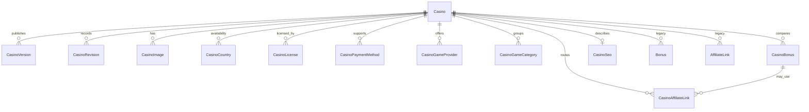
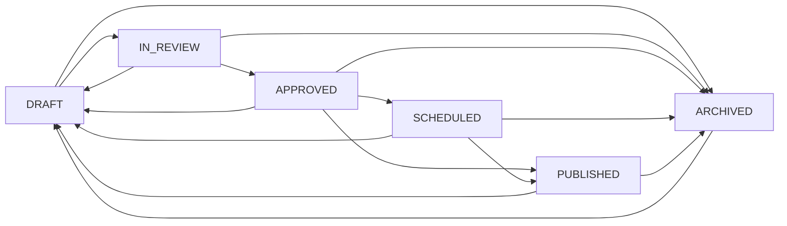

# Casino CMS Foundation

Phase 3.1 introduces an additive PostgreSQL domain for casino editorial content. It does not switch the current public pages or admin UI to the new data source.

## Compatibility boundary

- Public `/casinos` and `/casino/[slug]` pages continue to read `data/casinos.json`.
- The Phase 1 admin casino page continues to read the in-memory CMS repository.
- Existing `Bonus` and `AffiliateLink` tables remain unchanged.
- New structured offers use `CasinoBonus` and `CasinoAffiliateLink`.
- The new server API is available under `/api/admin/casinos` after migration `0006_casino_foundation` is applied in a later controlled step.

## Entity relationship diagram

## Entity responsibilities

| Entity | Responsibility |
| --- | --- |
| `Casino` | Aggregate root, editorial identity, review content, score, workflow and current version pointers. |
| `CasinoVersion` | Immutable full aggregate snapshot created only when a casino is published. |
| `CasinoRevision` | Immutable pre-change snapshot created for draft and workflow mutations. |
| `CasinoImage` | Logos, icons, hero images and ordered screenshots with accessible alternative text. |
| `CasinoCountry` | ISO country availability, restriction state, minimum age and editorial notes. |
| `CasinoLicense` | Authority, license number, status, verification source and review dates. |
| `CasinoPaymentMethod` | Deposit and withdrawal support, limits, fees, currencies and processing times. |
| `CasinoGameProvider` | Provider availability and verification metadata. |
| `CasinoGameCategory` | Ordered game categories and optional game counts. |
| `CasinoBonus` | Structured editorial offer data and offer lifecycle, separate from the legacy `Bonus` table. |
| `CasinoAffiliateLink` | Country-aware outbound destinations, optionally scoped to a structured casino bonus. |
| `CasinoSeo` | One-to-one search, canonical, social and structured-data metadata. |

All aggregate children use `ON DELETE CASCADE` from `Casino`. The optional bonus relation on `CasinoAffiliateLink` uses `ON DELETE SET NULL`, so removing an offer does not destroy a still-valid casino destination.

## Versioning model

`Casino.draftVersion` identifies the draft that editors are preparing. `Casino.publishedVersion` identifies the current public release.

1. A casino starts at draft version 1 and published version 0.
2. Each root update or workflow transition creates a `CasinoRevision` containing the complete pre-change aggregate.
3. Publishing creates one immutable `CasinoVersion` snapshot using the current draft version.
4. Publishing advances `publishedVersion` to that number and increments `draftVersion` for future edits.
5. Public PostgreSQL reads should resolve the latest published `CasinoVersion`, never a mutable draft aggregate.

Revision numbers and version numbers are unique per casino. The unique constraints also protect against concurrent duplicate history records.

## Workflow

Publication validation currently requires a title, valid domain, editorial summary, review description, editor score, licensing evidence and core SEO metadata. Scheduling requires an approved record and a future timestamp.

## Repository API

`CasinoStore` is the persistence contract. `CasinoRepository` implements it with Prisma and provides:

- filtered and paginated list reads;
- aggregate reads by id and slug;
- immutable published snapshot lookup;
- draft creation and uniqueness checks;
- optimistic, revision-backed updates;
- revision-backed workflow transitions;
- transactional publish plus version creation;
- revision and version history reads.

The aggregate query includes all new structured child entities but excludes legacy offers and history collections from snapshots.

## Service API

`CasinoService` owns input normalization, domain validation, workflow rules and publication validation. Its public methods are:

- `listCasinos`
- `getCasinoById`
- `getCasinoBySlug`
- `getPublishedSnapshot`
- `createDraft`
- `updateCasino`
- `validateCasino`
- `transitionWorkflow`
- `scheduleCasino`
- `publishCasino`
- `listRevisions`
- `listVersions`

URLs and domains are normalized before persistence. Content edits are accepted only while a record is in `DRAFT`; a published or review-stage record must explicitly return to draft first.

## Admin API foundation

| Method | Route | Purpose |
| --- | --- | --- |
| `GET` | `/api/admin/casinos` | Filtered PostgreSQL casino list. |
| `POST` | `/api/admin/casinos` | Create a casino draft. |
| `GET` | `/api/admin/casinos/[casinoId]` | Read a full casino aggregate. |
| `PATCH` | `/api/admin/casinos/[casinoId]` | Save root draft fields with optimistic concurrency. |
| `POST` | `/api/admin/casinos/[casinoId]/action` | Review, approval, scheduling, publishing and archive workflow. |
| `GET` | `/api/admin/casinos/[casinoId]/revisions` | Read revision and published-version history. |

The endpoints use the existing Better Auth dual-auth guard and the existing `casino.edit` permission. More granular casino view, review and publish permissions can be introduced with the Builder UI phase.

## Deferred work

- Apply migration `0006_casino_foundation` in a controlled deployment step.
- Import or reconcile the static JSON and legacy CMS casino records.
- Add child-entity mutation commands and restore-revision behavior.
- Build the Casino Builder UI.
- Switch admin and public reads only after import verification and parity tests.
- Add granular casino workflow permissions before production editor rollout.
